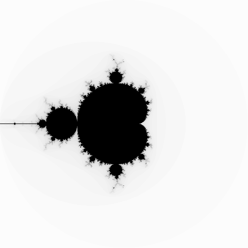

# mandelR
## Playing with Mandelbrot sets in R

This is a repository of scripts for playing about with mandelbrot sets in R.

You can run the scripts with `Rscript`:

```bash
$ Rscript mandelRnaive.R
```

will produce an output.png that looks like this:



Plotting is provided by `pnmmodules` (https://github.com/owainkenwayucl/pnmmodules)