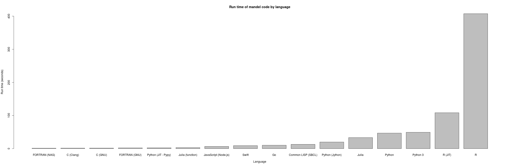

Quick benchmarks of the various implementations
===============================================

All benchmarks were run on a Dell XPS 13 with Intel(R) Core(TM) i5-5200U CPU, 8 gigabytes of RAM, SSD and Ubuntu 16.04.

Timings are indicative only.  

* For compiled languages, the default level of optimisation is used.

* All examples were modified to do 2048x2048 image over the same X/Y range with the same max iterations.

