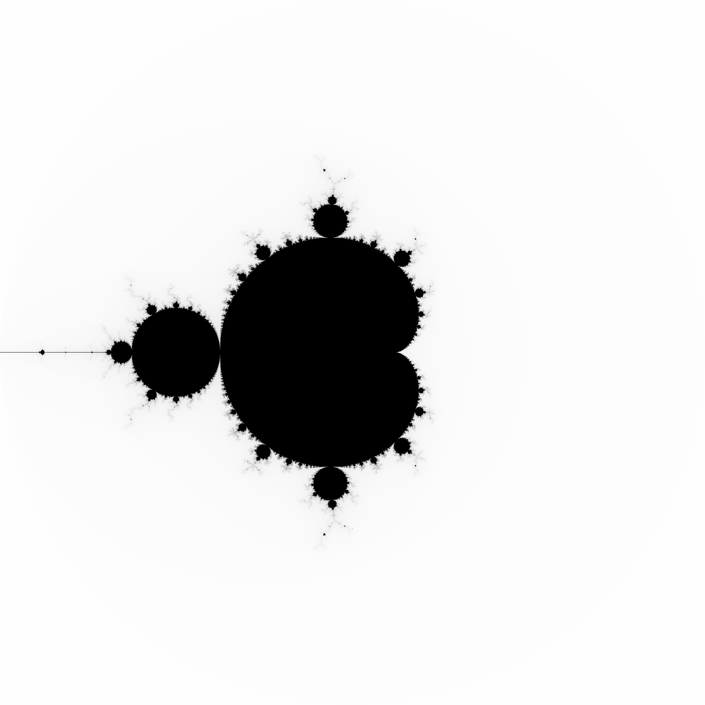

# mandel
## Implementation in Fortran

This directory has a Fortran implementation.  

It uses the `imageout` module from my [ruflib](https://github.com/owainkenwayucl/ruflib) library.

You should compile it with:

```bash
$ FC=<compiler> make
```

For some <compiler> (nagfor, gfortran etc.).

You can run the binary with:

```bash
$ ./mandel
```

will produce a `mandel.pgm` that looks like this:

