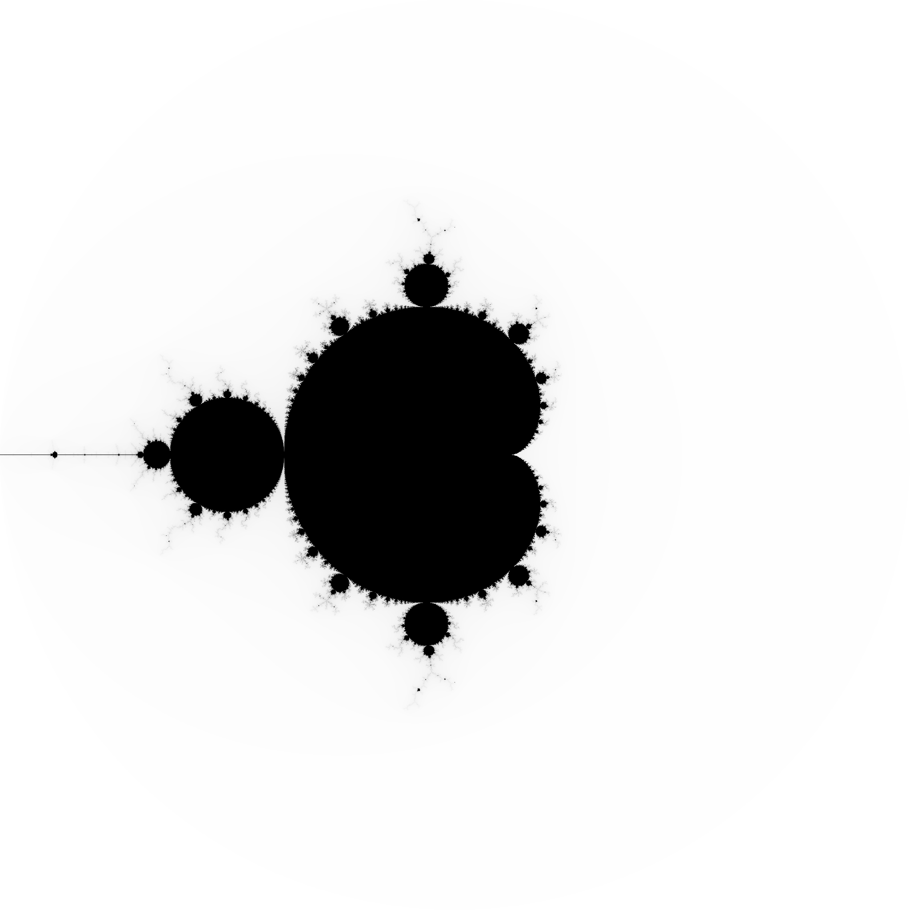

# mandel
## Implementation in Go

This directory has a Go implementation.  

You should compile it with:

```bash
$ export GOPATH=`pwd`
$ go build pnmmodules
$ go install pnmmodules
$ go build src/mandel.go
```

You can run the binary with:

```bash
$ ./mandel
```

will produce a `mandel.pgm` that looks like this:



Plotting is provided by `pnmmodules` (https://github.com/owainkenwayucl/pnmmodules)