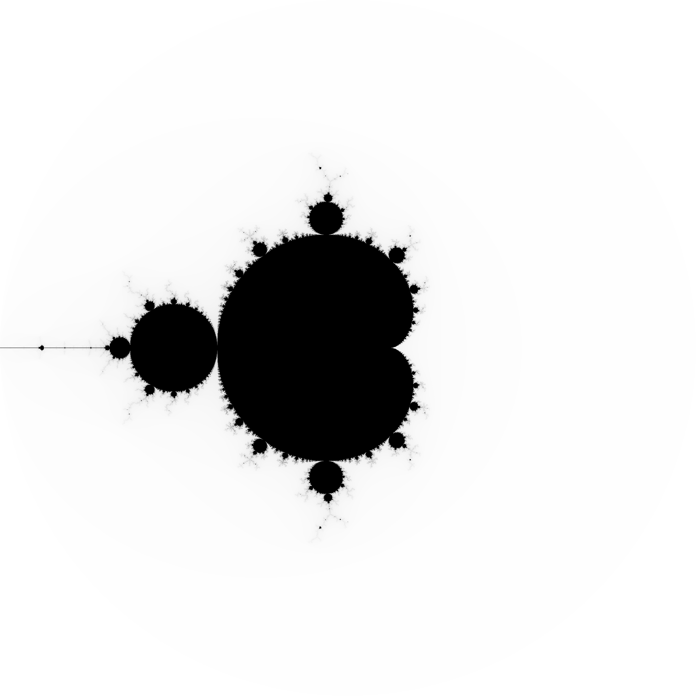

# mandel
## Playing with Mandelbrot sets in JavaScript

This is a repository of scripts for playing about with mandelbrot sets in JavaScript/Node.js.

You can run the scripts with `nodejs`:

```bash
$ nodejs mandel.js
```

will produce a `mandel.pgm` that looks like this:



Plotting is provided by `pnmmodules` (https://github.com/owainkenwayucl/pnmmodules)