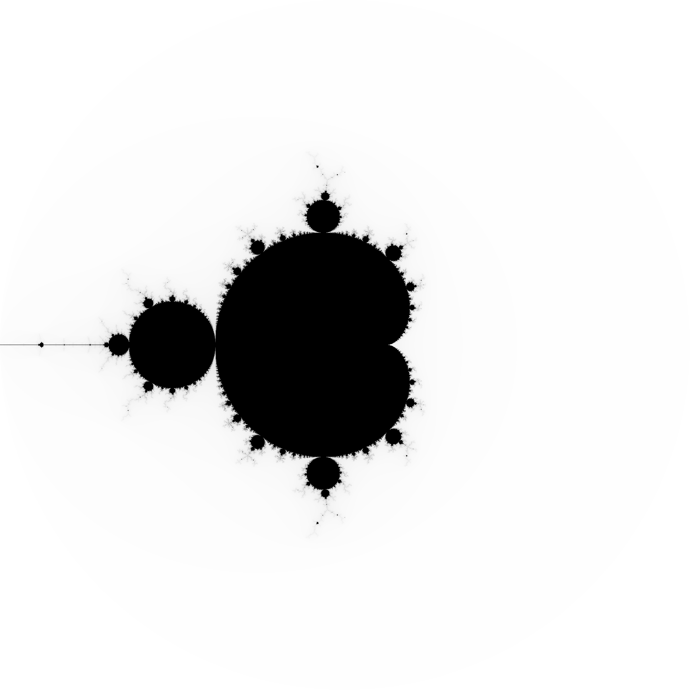

# mandel
## Playing with Mandelbrot sets in Julia

This is a repository of scripts for playing about with mandelbrot sets in Julia.

You can run the scripts with `julia`:

```bash
$ julia mandel.jl
```

will produce a `mandel.pgm` that looks like this:



Plotting is provided by `pnmmodules` (https://github.com/owainkenwayucl/pnmmodules)