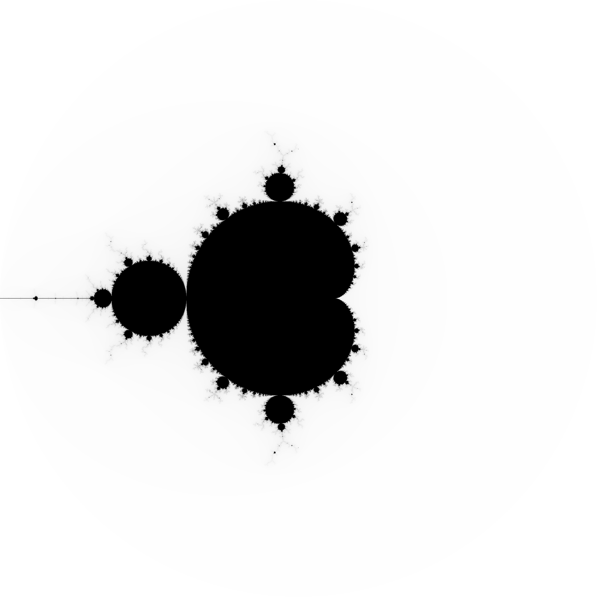

# mandel
## Playing with Mandelbrot sets in Python

This is a repository of scripts for playing about with mandelbrot sets in Python.

You can run the scripts with `python3`:

```bash
$ python3 mandel.py
```

will produce a `mandel.pgm` that looks like this:



Plotting is provided by `pnmmodules` (https://github.com/owainkenwayucl/pnmmodules)