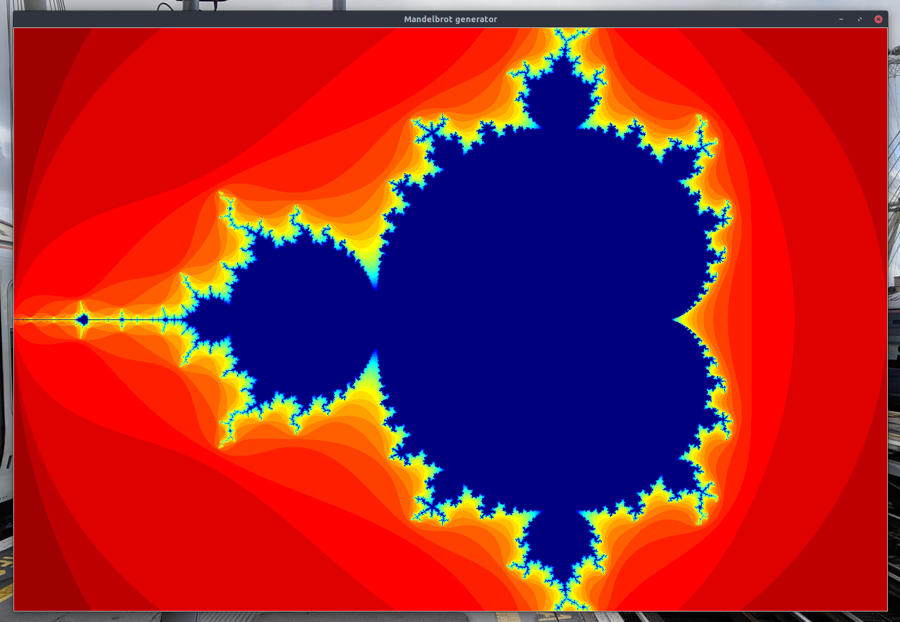

# mandel
## Playing with Mandelbrot sets in Python

This is a repository of scripts for playing about with mandelbrot sets in Python.

You can run the scripts with `python3`:

```bash
$ python3 mandel.py
```

will produce a `mandel.pgm` that looks like this:


Plotting is provided by `pnmmodules` (https://github.com/owainkenwayucl/pnmmodules)

There is also a graphical implementation which uses Tkinter to display a generated image instead of writing one.  You can run it with:

```bash
$ python3 mandel_tkinter.py
```

It will then ask you for values of various variables (press return for defaults), calculate the Mandelbrot set and then draw it to a Window.

If you select the default values you should get something like this:


